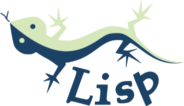

<h1>Lisp Logo</h1>

---

The SVG version of [Manfred Spiller's Lisp logo](https://web.archive.org/web/20060105182921/http://www.normal-null.de/lisp_logo.html). The original site only provided raster versions.

## License

> "Anyone may use these logos freely for any purpose and in any way. Attribution of the logos to their creator is not necessary but will be appreciated." — Manfred Spiller

While the original site doesn't specify a formal license, based on the above statement, I believe the most appropriate license would be `CC0 (Creative Commons Zero)`.

## Credits

Special thanks to my friend [Raga Punggawa](https://twitter.com/pagarmidna), a talented graphic designer, for helping create the SVG version of the logo.

## Similar Works

- [JSCL](https://github.com/jscl-project/jscl) logo  by [Michał Herda](https://github.com/phoe).

